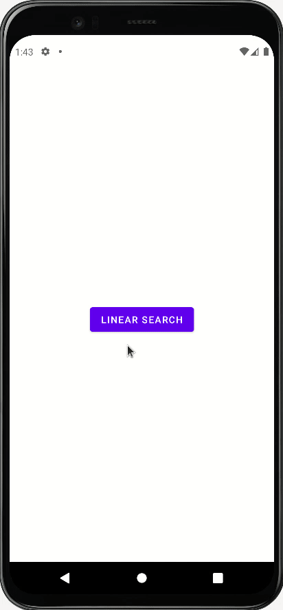

# DSAV
### Data Structures and Algorithms Visualization
This app help us to visualize concepts of DSA.Currently we had added visualization of sorting and searching algotiyhms and visualization of stack and queue.In seaching we have linear search and binary search.In Sorting we have bubble,selection and insertion sort

## Linear Search
   

